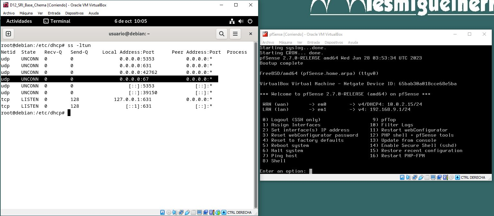

# Práctica 2 

## Instalación y configuración de servidor y cliente DHCP en Debian 

>En este documento vamos a realizar un tutorial en el que se describan los ficheros involucrados y los comandos necesarios para configurar el servidor isc-dhcp server en Debian. Es un tutorial guiado con capturas de pantalla con un ejemplo visual. En este ejemplo se sigue el siguiente esquema.


**1. Configuración de la IP estática en Debian y verificación**  

Para comenzar deberemos tener abiertos en el VirtualBox la máquina de Debian 12 y el Pfsense


Una vez hecho eso lo que tenemos que hacer es asignar una dirección IP fija para nuestro Debian ya que va a hacer función de servidor DHCP.  

Para ello accedemos a la Configuración de Red, y en el Cableado damos al engranaje. Vamos a IPv4 y seleccionamos Manual, ahora tenemos que darle una dirección de red válida dentro de nuestra red Interna.
Además le daremos el DNS del instituto para tener acceso a Internet.


Comprobamos que se ha guardado la configuración correctamente.


**2. Activar el super usuario con "su -" e instalación del DHCP**

Ahora tenemos que instalar el servicio, para poder instalar en sevidor dhcp en Debian


Ahora vamos a configurar el servidor para que escuche en la tarjeta de red que tenemos en el Debian, en la "enp0s3". Para ello tenemos que ir al fichero que aparece en la captura, en el cual se puede ver reflejado como en el apartado de *INTERFACESv4* nos sale en blanco, que es donde debemos añadir nuestra tarjeta.


**3. Copia de seguridad de la interfaz**

Para modificar el fichero primero tenemos que entrar como root, y como no tenemos este usuario en los sudo tenemos que usar el **su -** para estar como super ususario.  
Pero antes de entrar en el fichero, lo más recomendable en Debian es crear una copia de seguridad de dicho fichero usando el siguiente comando.
```
cp /etc/default/isc-dhcp-server /etc/default/isc-dhcp-server.copia
```


**4. Configuración del nombre de la interfaz**

A continuación modificamos el archivo con el comando nano.
```
nano /etc/default/isc-dhcp-server
```
Una vez dentro del archivo tenemos que ir al apartado de *INTERFACESv4* y poner entre las comillas nuestra tarjeta de red, y lo guardamos.


**5. Configuración principal del DHCP, hacemos copia y cambiamos los parámetros**

Nos movemos al directorio que se nos ha creado, llamado **/etc/dhcp/**.  
Ahi podemos ver que tenemos un fichero llamado *dhcp.conf* en el caul se puede configurar el rango de IP, la máscara, la puerta de enlace, el DNS...  
Como es el fichero principal, lo primero que tenemos que hacer es una copia del fichero.


Entramos en el fichero con el comando **nano**, dentro del fichero hay muchos apartados en comentario, que no se estan ejecutando en el fichero, que son trozos de tipos de configuraciones que podemos elegir a las cuales solo falta cambiarlas los valores por los nuestros. En nuestro caso, la configuración que más nos interesa es el apartado que empieza por: *# A sligthly different configuration for a internal subnet*.  
Tendremos que ir descomentando y poniendo los valores que nos interesan para la práctica, que es igual que en Windows solo que aqui en vez de poner ámbito como en Windows, se le hace referencia en subnet. Quedandonos el fichero de la siguiente manera.


**6. Reservamos la IP**

Para poder hacer reservas, se hace dentro de este mismo fichero de configuración en unos bloques que aparecen llamados *host* en nuestro caso vamos a utilizar el *host fantasia* ya que es el que mejor se ajusta a lo que buscamos, y el funcionamiento es igual que antes, descomentando y cambiando los valores por los que nos interesan. Al ser una reserva de IP tenemos que ir buscar la dirección MAC del equipo que queremos para poder hacer la reserva.  
En el VirtualBox buscamos un equipo cliente al que hacer la reserva y que esté dentro de la misma red interna. La dirección MAC de mi equipo cliente es: ***08:00:27:02:C7:BF*** y le reservamos la IP **192.168.9.60**


**7. Reinicio del servicio**

Una vez guardado el fichero configurado, como estamos en Linux, cada vez que modificamos un archivo de configuración hay que reiniciar el servicio. Para ello usamos el comando.  
```
systemctl status isc-dhcp-server
```  
Esto nos da el estado del servicio, que por el momento va a estar caido. Para reiniciarlo tenemos que parar el servicio y luego volver a arrancarlo con los comandos siguientes.  
```
systemctl stop isc-dhcp-server
systemctl start isc-dhcp-server
```
Y si volvemos a ver ek status podemos ver que esta en funcionamiento.


**8. Comprobación de que está escuchando**

Otra de las cosas que tenemos que comprobar es ver si el servidor esta escuchando, para poder recibir las peticiones de los clientes. Para comprobarlo ejecutamos el comando.
```
ss -ltun
```
Y aquí tenemos que ver si el puerto 67 en udp aparece en la lista, que significaría que funciona correctamente



**9. Ver las asignaciones en Debian y comprobar que al arrancar el cliente funciona**

Una vez completado esto tenemos que arrancar una máquina cliente para poder asignarle un IP automáticamente. Una vez arrancada volvemos al Debian y buscar en un fichero si el servidor DHCP le ha asignado una IP. El fichero es el *dhcpd.leases* para acceder al fichero tenemos que ir a **/var/lib/dhcp/**. En el fichero veremos que todavía no hay ninguna entrada ya que todavía no ha arrancado la máquina del todo.


Una vez iniciada la máquina virtual, vamos a comprobar que el dhcp le ha asignado la IP automáticamente, para ello tiene que estar configurado de antemano el cliente para poder recibir IP automáticamente. Una vez esté así hacemos un *ipconfig /all* para poder ver que se la ha dado nuestro servido DHCP, además que aparece el resto de configuración que hicimos antes, como el lease time o el sufijo DNS.


También podemos ver en el Debian que el DCHP funciona, abriendo el fichero *dhcpd.leases*. Ahi mediante el comando cat podemos ver como sale la información de la petición que nos ha hecho la máquina cliente.


Además tenemos que comprobar que la reserva se ha ejecutado correctamente, para ello arrancamos la máquina a la que le hicimos la reserva. Y comprobamos con el *ipconfig /all* que le da la ip que le habiamos reservado.  
Y también vemos que en el Debian, en el mismo fichero que antes, se ha actualizado con la IP reservada.


# LOGS
En última instancia vamos a explicar brevemente que son los logs y que función tienen.  
Los log son ficheros de texto que registran cronológicamente todas las actividades e incidencias que ocurren en el sistema operativo o red en Linux.  
Estos logs contienen información de muchos tipos, entre ellos estan:

1. Paquetes que se instalan o desinstalan en el SO.
2. Información sobre los accesos remotos al equipo.
3. Los intentos fallidos de autenticación.
4. Registros de errores que se dan en programas o servicios usados.
5. Accesos o salidas que bloquea nuestro firewall

Gracias a los logs de Linux podemos saber que esta pasando en nuestro equipo lo que nos ayuda para diferentes problemas, como por ejemplo:

1. Detectar las causas de problemas del equipo o servidor.
2. Registrar y detectar ataques informáticos.
3. Detectar comportamientos no deseados de programas o servicios de nuestro equipo.
4. Ver rendimiendo del equipo o servidor.
5. Averiguar que ocurrió en una determinada actualización de un equipo.